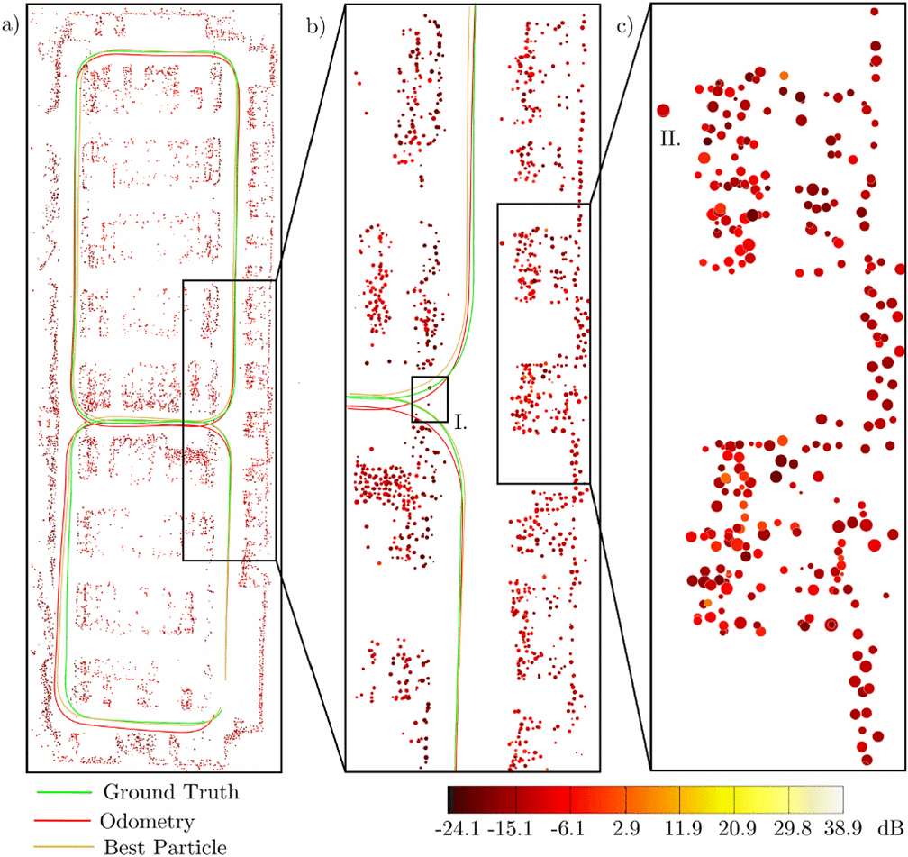

# radar-signal-clustering
Implementation of the DENSTREAM algorithm for clustering radar targets based on [Robust Localization based on Radar Signal Clustering](https://ieeexplore.ieee.org/document/7535485), Schuster, et al 2016.

At this point: Framework of algorithm currently implemented for simulated targets only. Have not used radar data from the TI mmWave 1642 or 1843 boards yet. Clustering parameters will need to tuned for real radar data.
